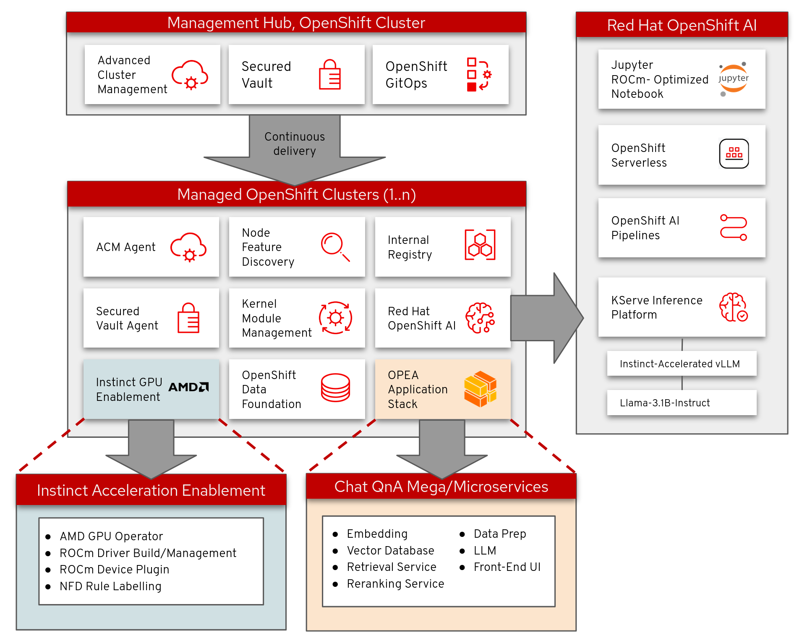

# OPEA QnA Chat with AMD Instinct

[](https://opensource.org/licenses/Apache-2.0)
[](https://www.amd.com/en/products/server-accelerators/instinct)
[](https://www.redhat.com/en/technologies/cloud-computing/openshift)

## 📋 Project Summary

This Validated Pattern implements an enterprise-ready Question & Answer chat application based on the Open Platform for Enterprise AI (OPEA) framework, accelerated by AMD Instinct GPUs. It provides a production-grade deployment pattern that combines OPEA's open-source AI capabilities with AMD's hardware acceleration, all orchestrated through OpenShift's enterprise platform.

### Key Features

- 🚀 AMD Instinct GPU acceleration for high-performance AI inference
- 🔒 Enterprise-grade security with HashiCorp Vault integration
- 🤖 OPEA-based AI/ML pipeline with specialized services for document processing
- 📊 Vector database support for efficient similarity search and retrieval
- 🔄 GitOps-based deployment and management through Red Hat Validated Patterns

## 🏗️ Architecture

The solution consists of several key components:

- **AI/ML Services**
  - Text Embeddings Inference (TEI)
  - Document Retriever
  - Reranking Service
  - LLM-TGI (Text Generation Inference) from OPEA
  - vLLM accelerated by AMD Instinct GPUs
  - Redis Vector Database

- **Infrastructure**
  - Red Hat OpenShift AI (RHOAI)
  - AMD GPU Operator
  - OpenShift Data Foundation (ODF)
  - Kernel Module Management (KMM)
  - Node Feature Discovery (NFD)

- **Security**
  - HashiCorp Vault
  - External Secrets Operator
  - Secure secret management across deployments



## 🚀 Getting Started

### Prerequisites

- OpenShift 4.[16-18] cluster
- AMD Instinct GPU(s)
- Llama-3.1-8B-Instruct model (or other [compatible model](https://github.com/opea-project/GenAIComps/tree/main/comps/llms/src/text-generation#validated-llm-models))

### Installation

1. Clone the repository:

   ```bash
   git clone https://github.com/your-org/qna-chat-amd.git
   cd qna-chat-amd
   ```

2. Configure your environment:

   ```bash
   cp values-secret.yaml.template values-secret.yaml
   # Edit values-secret.yaml with your configuration (already added to .gitignore)
   ```

3. Deploy the pattern:

   ```bash
   ./pattern.sh make install
   ```

### Testing

Run the test suite:

```bash
make test
```

Run the linter:

```bash
make lint
```

## 📄 License

This project is licensed under the Apache License 2.0 - see the [LICENSE](LICENSE) file for details.

## 🔗 Related Links

- [AMD GPU Operator](https://github.com/ROCm/gpu-operator)
- [AMD ROCm](https://rocmdocs.amd.com/en/latest/)
- [Open Platform for Enterprise AI (OPEA)](https://opea.dev/)
- [Red Hat OpenShift](https://www.redhat.com/en/technologies/cloud-computing/openshift)
- [Red Hat OpenShift AI](https://www.redhat.com/en/products/ai/openshift-ai)
- [Red Hat Validated Patterns](https://validatedpatterns.io)
- [vLLM](https://github.com/vllm-project/vllm)
